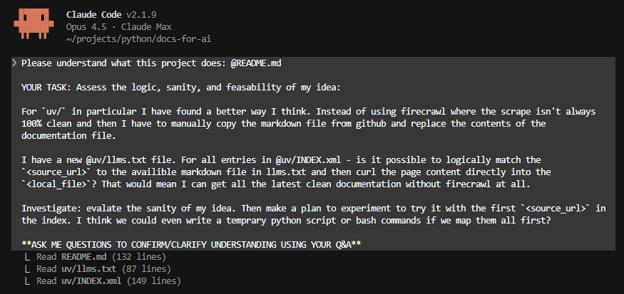

# Curate Docs For AI (with Claude Code)

Curate and index documentation from any website into collections like `tailwind/`, `horses/`, etc. Reference collection indexes in your AI chats (e.g. `@tailwind/INDEX.xml what's a utility?`) so that only relevant docs are analysed. Much cleaner than a web-fetch and more focussed than a web-search. Keep your AI context sharp.

<div align="center">
  
  <p><em>Complete workflow: curate → auto scrape → "/ask-docs biome Validate my config file please"</em></p>
</div>

## 📦 Repo Collections

Available collections in this repo:

| Collection | Collection Index | Description | Scraped | Source |
|:-----------|:-----------------|:------------|:--------|:-------|
| 📦 [`biome/`](biome/) | 📄 [`biome/INDEX.xml`](biome/INDEX.xml) | Fast linter/formatter | 2025-11-04 | [Official](https://biomejs.dev) |
| 📦 [`claudecode/`](claudecode/) | 📄 [`claudecode/INDEX.xml`](claudecode/INDEX.xml) | Anthropic Claude Code | 2026-02-05 | [Official](https://code.claude.com) |
| 📦 [`claudeplat/`](claudeplat/) | 📄 [`claudeplat/INDEX.xml`](claudeplat/INDEX.xml) | Anthropic Claude Platform | 2026-01-07 | [Official](https://platform.claude.com) |
| 📦 [`clerk/`](clerk/) | 📄 [`clerk/INDEX.xml`](clerk/INDEX.xml) | Authentication | 2025-12-03 | [Official](https://clerk.com) |
| 📦 [`convex/`](convex/) | 📄 [`convex/INDEX.xml`](convex/INDEX.xml) | Reactive database | 2026-01-07 | [Official](https://docs.convex.dev) |
| 🪝 [`lefthook/`](lefthook/) | 📄 [`lefthook/INDEX.xml`](lefthook/INDEX.xml) | Git hooks manager | 2025-11-24 | [Official](https://github.com/evilmartians/lefthook) |
| 📦 [`marimo/`](marimo/) | 📄 [`marimo/INDEX.xml`](marimo/INDEX.xml) | Reactive Python notebooks | 2025-11-11 | [Official](https://docs.marimo.io) |
| 📦 [`nextjs/`](nextjs/) | 📄 [`nextjs/INDEX.xml`](nextjs/INDEX.xml) | React framework | 2025-12-02 | [Official](https://nextjs.org) |
| 📦 [`playwright/`](playwright/) | 📄 [`playwright/INDEX.xml`](playwright/INDEX.xml) | Browser testing | 2025-11-07 | [Official](https://playwright.dev) |
| 📦 [`shadcn/`](shadcn/) | 📄 [`shadcn/INDEX.xml`](shadcn/INDEX.xml) | React UI components | 2025-12-16 | [Official](https://ui.shadcn.com), [Guide](https://shadcn.io) |
| 📦 [`shiny/`](shiny/) | 📄 [`shiny/INDEX.xml`](shiny/INDEX.xml) | Python web apps | 2025-11-02 | [Official](https://shiny.posit.co/py/) |
| 📦 [`tailwind/`](tailwind/) | 📄 [`tailwind/INDEX.xml`](tailwind/INDEX.xml) | CSS framework | 2025-10-15 | [Official](https://tailwindcss.com/docs/) |
| 📦 [`tailwindplus/`](tailwindplus/) | 📄 [`tailwindplus/INDEX.xml`](tailwindplus/INDEX.xml) | Paid UI Components | 2025-11-16 | [Official](https://tailwindcss.com/plus) |
| 📦 [`uv/`](uv/) | 📄 [`uv/INDEX.xml`](uv/INDEX.xml) | Python projects | 2026-05-19 | [Official](https://github.com/astral-sh/uv/tree/main/docs) |
| 📦 [`vercel/`](vercel/) | 📄 [`vercel/INDEX.xml`](vercel/INDEX.xml) | Deployment platform | 2025-10-20 | [Official](https://vercel.com) |
| 📦 [`vitest/`](vitest/) | 📄 [`vitest/INDEX.xml`](vitest/INDEX.xml) | Testing framework | 2025-11-05 | [Official](https://vitest.dev) |
| 📦 [`zustand/`](zustand/) | 📄 [`zustand/INDEX.xml`](zustand/INDEX.xml) | State management | 2026-01-03 | [Official](https://zustand.docs.pmnd.rs) |

*Curate your own collections. The [lefthook](lefthook/) collection is non-standard, docs directly downloaded from GitHub. For Anthropic docs use [this tool](https://github.com/ericbuess/claude-code-docs).*

---

## 🚀 Setup

```bash
# 1. Install UV
# 👉 https://docs.astral.sh/uv/getting-started/installation/

# 2. Clone repository
git clone https://github.com/michellepace/docs-for-ai.git
cd docs-for-ai

# 3. Get free FireCrawl API key (Only GitHub sources are downloaded directly)
# Visit: https://www.firecrawl.dev/app/api-keys

# 4. Add to your shell profile
echo 'export API_KEY_MCP_FIRECRAWL=your-api-key-here' >> ~/.zshrc
source ~/.zshrc  # Use ~/.bashrc if that's your shell
```

## 📖 Usage via Slash Commands

> [!IMPORTANT]
> Edit the paths in [.claude/commands/ask-docs.md](.claude/commands/ask-docs.md) to match your local setup. To use from anywhere, move it to `~/.claude/commands/`.

| Slash Command | Purpose | .md Files | INDEX `<source>` |
|:--------|:--------|:----------|:----------|
| `/curate-doc <collection> <url>` | Add new or re-scrape | ✅ Write | ✅ Add/update INDEX.xml |
| `/rescrape-docs <collection>` | Re-scrape all docs | ✅ Write all | ✅ Selective update INDEX.xml |
| `/improve-index-xml <collection>` | Batch improve descriptions | 📖 Read | ✅ Update INDEX.xml |
| `/ask-docs <collection> <question>` | Query any collection | Docs analysed | Relevant docs identified |

## 💡 Usage Example

Assume tailwind was not already a collection in this repo:

```bash
# Start a new collection
/curate-doc tailwind https://tailwindcss.com/docs/customizing-colors
# → Creates tailwind/ collection directory, with README.md + INDEX.xml, and first curated doc

# Re-scrape existing doc (refresh content from same URL)
/curate-doc tailwind https://tailwindcss.com/docs/customizing-colors
# → Re-scrapes, writes .md file, replaces source in INDEX.xml

# Curate a new doc into collection
/curate-doc tailwind https://tailwindcss.com/docs/styling-with-utility-classes
# → Scrapes page into collection, writes .md file, adds source to INDEX.xml

# Re-scrape all docs in collection
/rescrape-docs tailwind
# → Re-scrapes all URLs in INDEX.xml, writes all .md files, updates descriptions for changed content

# ✨ Use the docs
/ask-docs tailwind Please evaluate my project for correct usage of utility classes?
# → Searches tailwind/INDEX.xml for relevant docs, analyses these, gives you an answer
```

## 🏗️ How This Repo Works

**Workflow:** Python script fetches from source URL → writes .md file → creates INDEX.xml entry with `PLACEHOLDER` description → Claude Code generates semantic description.
The `/curate-doc` command always regenerates the description, whereas `/rescrape-docs` only regenerates descriptions for files with content changes.

**Source routing:** If the source URL is on GitHub, a direct fetch is used instead of FireCrawl.

**Directory Structure:**

```text
uv/
├── INDEX.xml               # Index of all docs
├── README.md
├── api-reference.md        # Scraped doc
├── getting-started.md      # Scraped doc
└── ...
```

**INDEX.xml Schema:**

```xml
<docs_index>
  <source>
    <title>Hello Document Title</title>
    <description>20-30 word dense summary optimised for semantic search...</description>
    <source_url>https://docs.example.com/hello</source_url>
    <local_file>hello-document-title.md</local_file>
    <scraped_at>2025-10-15</scraped_at>
  </source>
  <!-- Multiple <source> entries, one per .md file -->
</docs_index>
```

Scripts use the FireCrawl Python SDK for general web sources and Python stdlib (`urllib.request`) for GitHub raw markdown.

---

## 👉 Notes to Improve later

### New Idea (2026.01.16) — use `llms.txt` + direct fetch

Instruction given to Claude Code and successfully run on `uv/` directory to update all documents via direct HTTP fetch (Python script), so no scraping, 100% clean, and no Firecrawl tokens.

<div align="center">
  <a href="images/20260116_better_idea.jpg">
    
  </a>
  <p><em>Refactor to use llms.txt + direct fetch</em></p>
</div>

Adding this as a note for later to refactor to this method. (The screenshot mentions `curl` but we used Python's `urllib.request`.)

### New Idea (2026.05.20) — Drop Redundant Collections

Next.js already comes with its docs installed and indexed.

There's a claude-code-guide agent now too.

Lefthook has https://lefthook.dev/llms.txt
