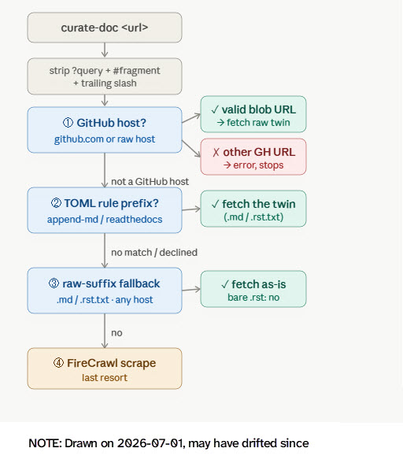

Desired scenarios for simplifying.

Principles:

1. Use scrape as a fallback
2. How a doc is obtained is irrelevant to how we get `<local_file>` and `<title>`, this depends on the file format
3. Firecrawl will always scrape to `.md`

```python
uv run curate-doc <collection_dir> <URL>
```

## Precidence: getting the doc (falls through)



01. GitHub URLS: if it's a file, direct fetch it (any extension)

02. If URL matches a prefix in `direct-fetch-rules.toml`, direct fetch it's twin. `<source_url>` must be the non-twin.

    ```markdown
    - https://rich.readthedocs.io/en/stable/panel.html; twin: https://rich.readthedocs.io/en/stable/_sources/panel.rst.txt
    - https://nextjs.org/docs/app/getting-started/css; twin: https://nextjs.org/docs/app/getting-started/css.md
    - https://docs.convex.dev/ ("docs" first, what happens?)
    ```

03. If URL ends in [md|mdx|qmd|txt], direct fetch

    - https://www.mintlify.com/docs/create/files.md
    - No (matched on 2): https://nextjs.org/docs/app/getting-started/css.md
    - Known: both record a DIFFERENT source url → unsure of current behaviour (Two `<source>`'s or one?)

04. Fallback to firecrawl scrape

    - https://lefthook.dev/configuration/colors/
    - https://wisprflow.ai/ (what happens?)
    - https://does-not-exist.com/hello (what happens?)

05. Edge case: GitHub should direct fetch any file, but should I go to the trouble of direct fetching non-github urls that are too just files like .jpg, .svg, .pdf. Is this over engineering. What happens now if I do it.

    > For a URL that matches an append-md prefix but is not a doc page or its .md twin (e.g. it ends in .png, .html, .pdf) — should the rule step aside and let FireCrawl handle it (this is what readthedocs does, and it keeps today's behaviour), or should it force-append .md to it anyway (which would 404 on those non-page URLs)?

06. Edge case: firecrawl content not the same as direct fetch. So what happens in the scenario when you put a "non-md" looking URL in, and then later you put the ".md" at the end URL. two source entries right? this seems okay to me. not sure.

07. Edge case: `md-append` does not catch ULRs that end in .pdf, jpg etc. IT falls through to firecrawl. But these files should be directly fetch. but then how would you title them anyhow. this is such a remote use case. but how should I handle.

08. Handle when I get 404s (even though not all sites give them). This came up when I was testing URLs with different casing.

09. Don't allow curating the root .toml prefixes

10. `collections/uv` has a special case https://docs.astral.sh/uv/reference/cli/index.md in curate.py. need a better way. Also about round triping on re-curating.

Note: Shiny/other may hardcode rules → find and remove

## INDEX.xml

`<local_file>` from URL

- How does it work now?
- Is it noisy for index → simplify to minimal? (overlap risk?)

`<title>` from doc parsing

- Treat markdown family the same [md|mdx|qmd] (e.g `title:` → H1, fallback filename?)
- readthedocs (uses RST heading format)
- what is the fallback, is it sane?
